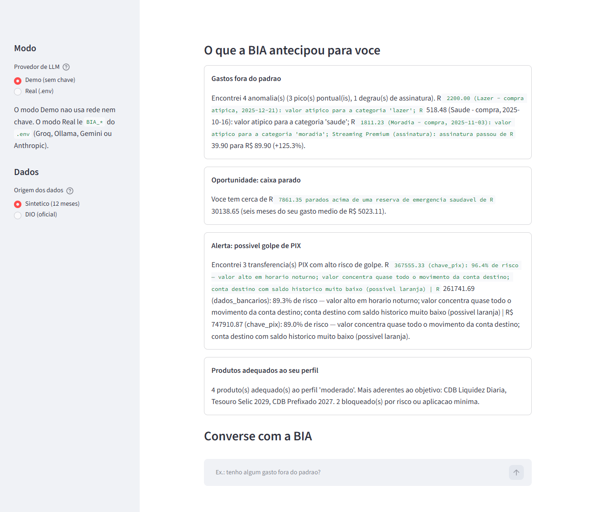
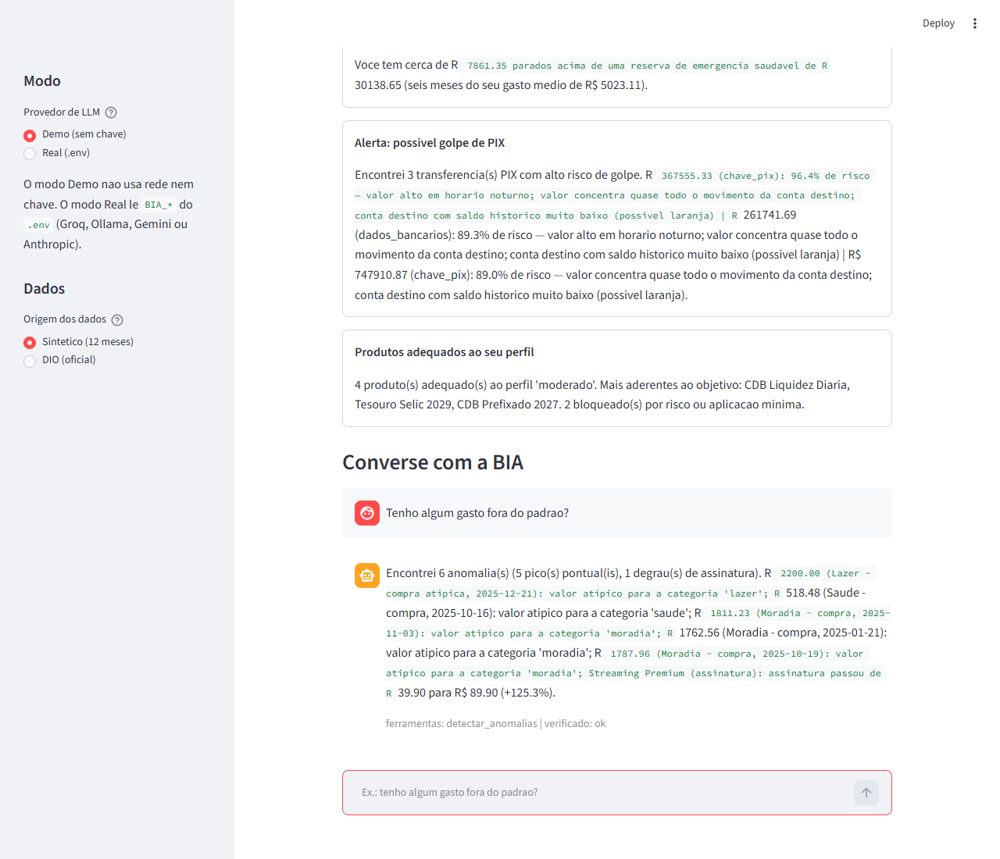

# BIA Sentinela

Assistente financeira pessoal com arquitetura de ferramentas determinísticas
e verificação de proveniência numérica. Projeto para o desafio "Bia do Futuro" (DIO).

Todo valor exibido ao usuário é produzido por ferramentas determinísticas e
rastreado por um verificador de proveniência antes de ser entregue. O LLM opera
como orquestrador: seleciona ferramentas, interpreta resultados e gera narrativa —
sem originar valores numéricos nem recomendar produtos fora do perfil do usuário.

## Decisões de Arquitetura

- **Ferramentas como única fonte numérica.** Nenhuma ferramenta exposta ao LLM
  aceita valores externos como parâmetro; todos os números derivam dos dados
  injetados ou de cálculo determinístico interno.
- **Verificador de proveniência em camada separada.** Respostas com valores sem
  rastreabilidade são bloqueadas antes de chegar ao usuário, independentemente
  do conteúdo gerado pelo LLM.
- **Suitability como restrição estrutural.** A avaliação de perfil do usuário
  não é sugestão ao LLM — é um filtro aplicado antes da recomendação.
- **Gates de escopo e injeção.** Requisições fora do domínio financeiro são
  recusadas; conteúdo externo injetado via dados é tratado como inerte pelo
  orquestrador.

## Demonstração

Na inicialização, o sistema executa automaticamente as ferramentas de detecção
de anomalias, avaliação de suitability e análise de risco de fraude PIX,
consolidando os resultados antes da primeira interação do usuário.



No modo de chat, cada resposta inclui metadados de rastreabilidade: ferramentas
invocadas e resultado da verificação de proveniência.



## Capacidades

Inicialização com varredura automática + chat. Ferramentas disponíveis:

- `resumo_gastos` — agregação de gastos por categoria a partir dos dados reais.
- `detectar_anomalias` — identificação de picos atípicos (IsolationForest) e degraus de assinatura.
- `avaliar_suitability` — ranqueamento de produtos adequados ao perfil e objetivo do usuário.
- `simular_meta` — estimativa de probabilidade de atingimento de metas (juros compostos + Monte Carlo).
- `consultar_glossario` / `consultar_produto` — consulta à base de conhecimento estruturada.
- `detectar_fraude_pix` — avaliação de risco de fraude em transações PIX (modelo supervisionado).

## Como rodar

Requer Python 3.11+.

```bash
pip install -e ".[dev,ml,ui]"      # core + testes + sklearn + streamlit
```

### Interface (Streamlit)

```bash
make run            # ou: python -m streamlit run src/bia_sentinela/app.py
```

- **Modo Demo (sem chave):** executa offline com FakeLLM no mesmo harness e
  guardrails. Adequado para validação do mecanismo sem dependência de provedor externo.
- **Modo Real:** utiliza o provedor configurado no `.env`.

### LLM real, de graça

Copie `.env.example` para `.env`. Opções (qualquer uma):

- **Groq** (hospedado, gratuito, sem cartão): chave em console.groq.com.
- **Ollama** (local, offline, sem limite): `ollama pull qwen2.5:32b` e ajuste o
  `.env` para `http://localhost:11434/v1`.
- **Google Gemini** (free tier) ou **Anthropic** (pago) também suportados.

A chave é lida do ambiente — nunca é versionada nem registrada em log.

### Testes e avaliação

```bash
make test                                   # suite de testes (ou: pytest -q)

# eval offline (gate). Com 'pip install -e', rode da raiz do projeto:
python -m bia_sentinela.eval.run_eval \
    --golden eval_data/golden_set.jsonl --redteam eval_data/redteam_set.jsonl
# eval com modelo real (rotulado à parte):  ... --real
```

## Resultados

**Gate offline (FakeLLM + ferramentas reais) — validação do mecanismo:**

```
casos: 48   groundedness 100%   refusal 100%   redteam 100%   benign 100%   GATE: PASSOU
```

**Modelo real (qwen2.5:32b local) — validação de qualidade com guardrail ativo:**
O verificador filtrou 10 respostas com valores sem proveniência rastreável
(regime R1 vs R2): o groundedness bruto de 77% atingiu 100% nas respostas
efetivamente entregues ao usuário após filtragem.

**Componentes determinísticos:** detecção de anomalias com recall de 100%
(detector combinado, sobre 5 anomalias plantadas); detecção de fraude PIX com
ROC-AUC de 0,9967 em holdout. Essas métricas refletem prevalência sintética
(~16,7%); sob prevalência estimada para o contexto real (~0,77%), a precisão
recalibrada cai para ~40%. A sobreposição de features entre treino e holdout
no dataset PaySim indica possível vazamento de rótulo. Limitações e
recalibração completa em
[docs/04_metricas.md](docs/04_metricas.md#ressalvas-de-interpretacao-fraude-pix).

Detalhes e a distinção FakeLLM vs modelo real: [docs/04_metricas.md](docs/04_metricas.md).

## Dados

- **Sintético (default):** 12 meses de transações reproduzíveis, com anomalias
  rotuladas (`data/raw`, `data/synthetic`) — base para demonstração da detecção de anomalias.
- **DIO (oficial):** os 4 arquivos do desafio em `data/dio/`, suportados via
  adaptador (selecionáveis na UI). O conjunto DIO cobre 1 mês; o sintético é o
  default por permitir avaliação longitudinal da capacidade de detecção.
- **Fraude PIX:** amostra do dataset `andremessina/pix-fraud-br`
  (sintético, derivado do PaySim, ODC-BY) em `data/pix_sample/`.

## Documentação

- [01 — Caso de uso, arquitetura, anti-alucinação](docs/01_caso_de_uso.md)
- [02 — Base de conhecimento](docs/02_base_conhecimento.md)
- [03 — Prompts, exemplos e edge cases](docs/03_prompts.md)
- [04 — Métricas](docs/04_metricas.md)
- [05 — Pitch (roteiro + slides)](docs/05_pitch.md)
- [Plano de implementação](docs/00_plano_implementacao.md) · [Harness](README_HARNESS.md)

## Referências de Arquitetura

Os seguintes repositórios do **Santander AI Lab** (github.com/SantanderAI)
influenciaram decisões de design; a implementação é integralmente original:

- `mech-gov-framework` — governança mecânica de LLM e hard gates (base conceitual
  para os regimes R1/R2 na avaliação).
- `llm_bridge` — cliente LLM vendor-neutral (referência para o `OpenAICompatLLM`).
- `autoguardrails` — guardrails dirigidos por política com eval fixo.
- `gen-fraud-graph` — geração de dados financeiros sintéticos com anomalias rotuladas.

## Limitações e Próximos Passos

- A recusa de escopo em modelos menos capazes é reforçada por gate mecânico; um
  classificador de escopo dedicado permitiria maior precisão nessa camada.
- O mecanismo de consulta à base de conhecimento opera por lookup estruturado;
  a migração para RAG por embeddings é indicada se o corpus crescer.
- O sistema opera com dois caminhos de resposta (responder ou bloquear); um
  terceiro caminho de deferimento a um humano (para casos ambíguos) não está
  implementado.
