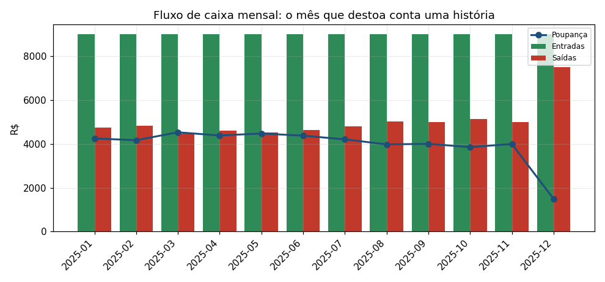
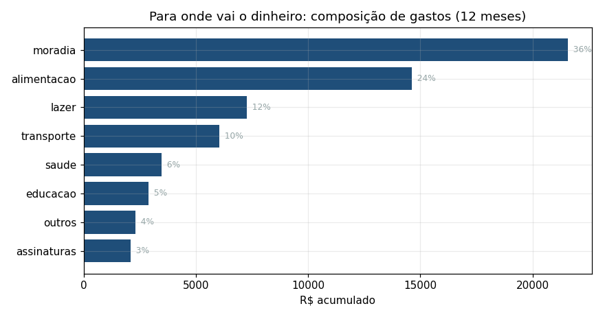
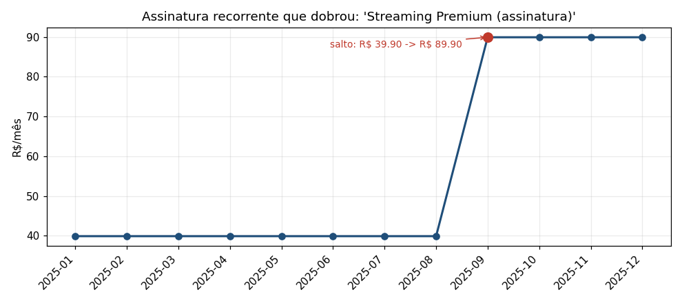
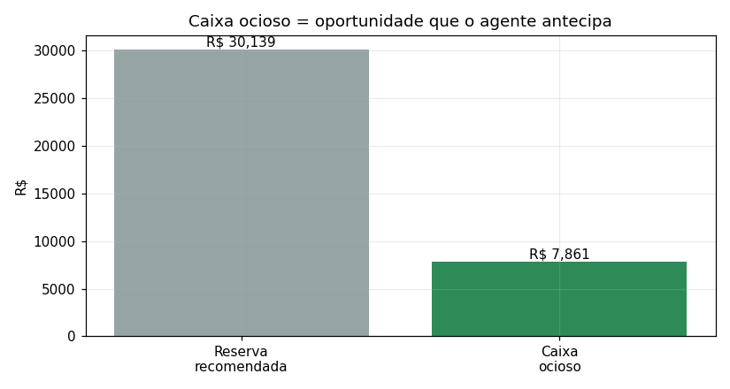

# História dos dados — por que a BIA Sentinela é proativa

> Análise exploratória (EDA) do cliente `cli_0001`.
> Gerada por `analysis/eda.py` sobre `data/raw/` · métricas em `analysis/eda_report.json`.
> Os números são reproduzíveis (seed fixa); troque pelos dados reais e rode o
> script para atualizar.

A análise percorre 12 meses de transações e identifica quatro padrões que viram
gatilhos proativos do agente.

## A base

264 transações ao longo de 12 meses (jan–dez/2025), 0% de valores nulos, 9
categorias distintas. Renda mensal estável de R$ 9.000 e taxa de poupança média
de 44%. Os pontos de interesse estão nos desvios, não na média.

## 1 — O mês que destoa

Onze meses seguem um padrão estável: entra R$ 9.000, saem ~R$ 4.000–5.000, sobra
a diferença. Dezembro quebra o padrão: as saídas saltam e a poupança cai. O
gasto do mês fica +27,6% acima da média móvel de 3 meses — desvio que um extrato
comum esconde e a média móvel expõe. Vira um alerta de gasto atípico.

## 2 — Para onde o dinheiro vai

Moradia domina com 35,8% do gasto acumulado, seguida de alimentação e
transporte. Essa composição é o contexto que torna uma conversa consultiva
específica em vez de genérica.

## 3 — A assinatura que dobrou

Uma assinatura recorrente — *Streaming Premium* — ficou 8 meses estável em
R$ 39,90 e então dobrou para R$ 89,90 (+125%). Detectá-la exige distinguir uma
assinatura (linha única, valor estável) de compras avulsas com a mesma descrição
e achar o degrau via changepoint entre dois patamares estáveis (ver
`data/features.py`). Vira um alerta de economia.

## 4 — Caixa ocioso

Com gasto médio de ~R$ 5.023/mês, uma reserva de emergência de 6 meses seria
~R$ 30.139. O cliente tem R$ 38.000 em conta, ou seja, R$ 7.861 ociosos.
Cruzando com o perfil *moderado*, o agente pode sugerir — dentro do que a
suitability permite — alocar o excedente em renda fixa de liquidez diária. O
número vem da análise; o LLM não o inventa.

## Da análise ao agente

Cada padrão vira um gatilho alimentado pela camada de dados, e cada número
exibido nasce aqui, não no LLM:

| Insight | Feature | Vira no agente |
|---------|---------|----------------|
| Mês fora do padrão | `media_movel_gastos` (desvio vs. média móvel) | alerta de gasto atípico |
| Composição de gastos | `gasto_por_categoria` | contexto consultivo |
| Assinatura dobrou | `cobrancas_recorrentes` (changepoint) | alerta de economia |
| Caixa ocioso | `caixa_ocioso` + suitability | sugestão de investimento |

A camada de dados decide o que vale antecipar; o harness garante que, ao
comunicar esses insights, nenhum número seja inventado e nenhuma recomendação
saia do perfil.
